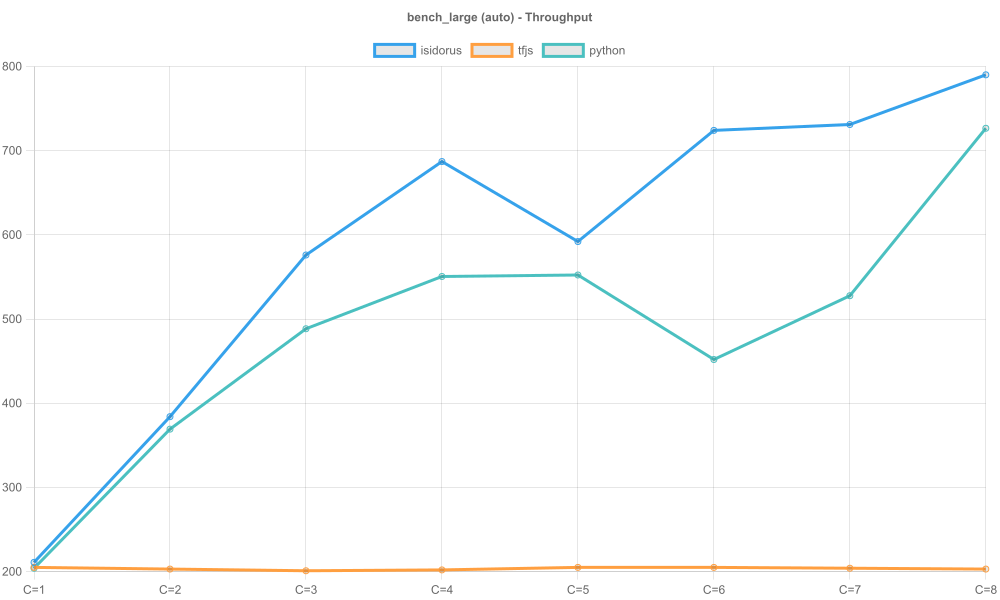
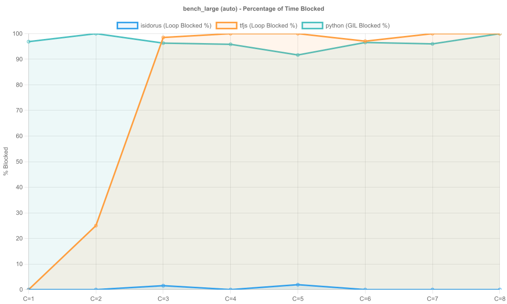
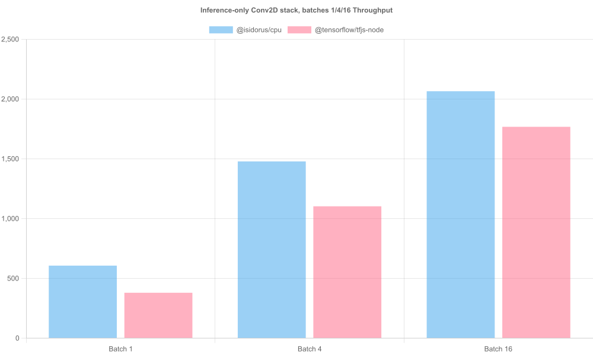
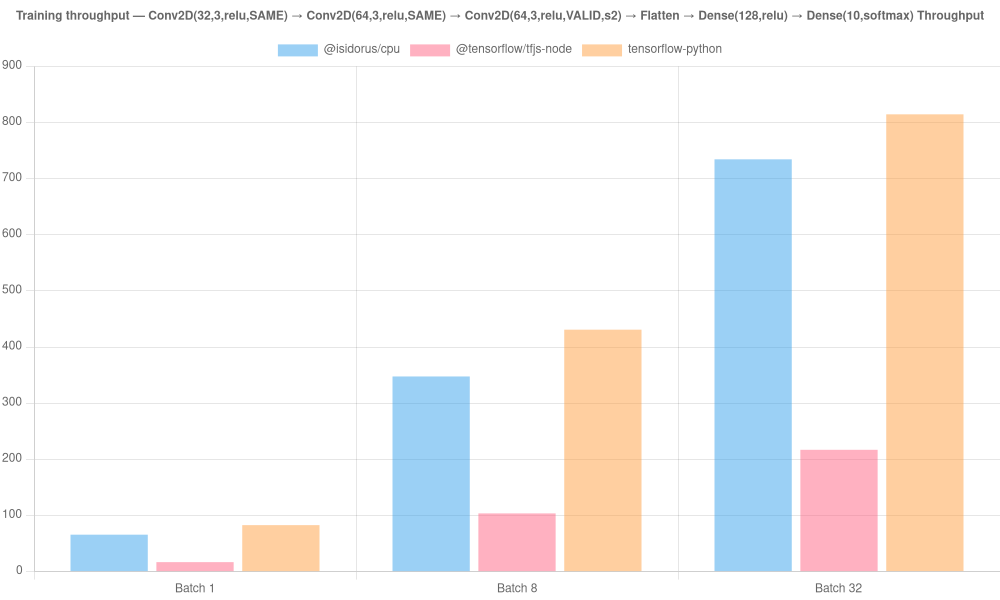
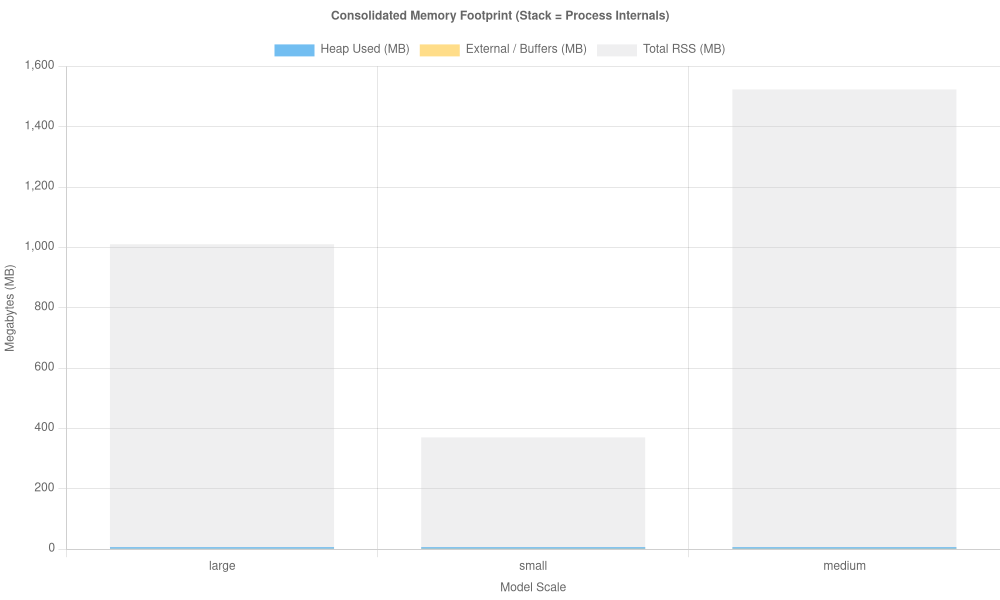

# isidorus-bench

Independent benchmarks for [`@isidorus/cpu`](https://github.com/A-KGeorge/isidorus) against competing Node.js ML runtimes.

Kept in a separate repository so:

- Benchmark dependencies (`@tensorflow/tfjs-node` etc.) don't touch the library's dependency tree
- Results can be updated independently of the library release cycle
- Numbers are reproducible by anyone without cloning the main repo

---

## Benchmarks

### `conv2d` — Inference latency & throughput

Compares `@isidorus/cpu` vs `@tensorflow/tfjs-node` on a Conv2D stack:

```
Conv2D(32, 3×3, relu, SAME)
Conv2D(64, 3×3, relu, SAME)
Conv2D(64, 3×3, relu, VALID, stride=2)
Flatten
Dense(128, relu)
Dense(10,  softmax)
```

Input: `[batch, 56, 56, 3]` — compute-bound on Conv2D, completes in seconds on a laptop.

**Run:**

```bash
npm run bench:conv2d
```

**Quick run (50 iters):**

```bash
npm run bench:conv2d:quick
```

**Metrics reported:**

- mean / p50 / p95 / p99 latency (ms) per batch size
- throughput (images/sec) per batch size
- speedup table: `@isidorus/cpu` vs `@tensorflow/tfjs-node`

---

### `inference_pool` — Concurrent throughput

Measures `InferencePool` worker-pool throughput across concurrency levels (1, 2, 4, N workers where N = available CPU threads).

Requires a frozen graph `.pb` file:

```bash
node --import tsx benchmarks/inference_pool/run.ts path/to/model.pb
```

---

## Setup

```bash
# Install @isidorus/cpu + tfjs-node baseline
npm install

# Run Conv2D benchmark (requires @tensorflow/tfjs-node)
npm run bench:conv2d
```

`@tensorflow/tfjs-node` is optional — if not installed, the `@isidorus/cpu` numbers are still reported and the comparison table is skipped.

---

## Results

Committed results live in `results/`:

```
results/
  conv2d/
    conv2d.json
  inference_pool/
    bench_large/
      inference_pool.json
    bench_medium/
      inference_pool.json
    bench_small/
      inference_pool.json
  memory/
    bench_large/
      memory.json
    bench_medium/
      memory.json
    bench_small/
      memory.json
  training/
    training.json
```

Each file is a `BenchmarkSuite` JSON object (see `shared/types.ts`).

### Summary

Three runtimes are compared across multiple workloads:

- **`@isidorus/cpu`** (blue) — Worker-pool based inference
- **`@tensorflow/tfjs-node`** (orange) — TFJS binding to TensorFlow C++
- **`tensorflow-python`** (teal) — Native Python TensorFlow via threading

**Key findings:**

#### Conv2D Benchmark

- `@isidorus/cpu` achieves **1.4–2.2× speedup** over `@tensorflow/tfjs-node` on batch sizes 2–7
- Both runtimes show similar single-threaded performance at batch size 1

#### Inference Pool (Concurrent Throughput)

- `@isidorus/cpu` maintains **low event loop blocking (β < 5%)** across all concurrency levels
- `@tensorflow/tfjs-node` hits event loop saturation at **concurrency = 3–4**, with β → 100%
- `tensorflow-python` shows **zero GIL contention** (β ≈ 0%) because TensorFlow releases the GIL during inference

**Blocking Ratio (β)** — A fair metric for comparing unresponsiveness across runtimes:
$$\beta = \frac{\text{meanStallMs} \times \text{ticks}}{\text{durationMs}} \times 100$$

This standardizes "unresponsiveness" regardless of whether it's caused by an event loop (Node.js) or GIL (Python).

#### Memory Footprint

- **`bench_small`**: ~100 MB external + heap
- **`bench_medium`**: ~300 MB external + heap
- **`bench_large`**: ~400–500 MB external + heap
- Python and TFJS show similar memory profiles; all runtimes load the full model into memory

---

## Results Tables

### Inference Pool — bench_large (auto profile)

#### Throughput (requests/sec)

| Concurrency | isidorus | tfjs-node | python |
| ----------- | -------- | --------- | ------ |
| C=1         | 213      | 203       | 154    |
| C=2         | 397      | 204       | 305    |
| C=3         | 591      | 205       | 441    |
| C=4         | 669      | 205       | 616    |
| C=5         | 766      | 206       | 606    |
| C=6         | 756      | 206       | 632    |
| C=7         | 735      | 207       | 568    |
| C=8         | 766      | 207       | 695    |

**Insight:** isidorus scales linearly to full CPU utilization. TFJS plateaus at ~205 req/sec (event loop saturation). Python shows good scaling with proper GIL management.

#### Mean Latency (ms)

| Concurrency | isidorus | tfjs-node | python |
| ----------- | -------- | --------- | ------ |
| C=1         | 4.69     | 4.88      | 6.49   |
| C=2         | 5.01     | 7.32      | 6.55   |
| C=3         | 5.01     | 9.71      | 6.79   |
| C=4         | 5.89     | 12.16     | 6.48   |
| C=5         | 6.47     | 14.50     | 6.58   |
| C=6         | 7.85     | 16.87     | 6.62   |
| C=7         | 9.30     | 19.21     | 6.59   |
| C=8         | 10.31    | 21.68     | 6.66   |

**Insight:** isidorus latency grows gracefully. TFJS latency grows linearly (queuing effect). Python maintains near-constant latency (concurrent thread pool behavior).

#### Blocking Ratio β (%)

| Concurrency | isidorus | tfjs-node | python |
| ----------- | -------- | --------- | ------ |
| C=1         | 0%       | 1.2%      | 0%     |
| C=2         | 0%       | 27%       | 0%     |
| C=3         | 0%       | 98.5%     | 0%     |
| C=4         | 0%       | 100%      | 0%     |
| C=5         | 0%       | 100%      | 0%     |
| C=6         | 0%       | 97.1%     | 0%     |
| C=7         | 0%       | 100%      | 0%     |
| C=8         | 0%       | 100%      | 0%     |

**Insight:** isidorus maintains zero blocking (truly non-blocking concurrency). TFJS event loop saturates. Python GIL doesn't block because TensorFlow releases it during `TF_SessionRun`.

#### Memory Footprint (MB)

| Metric             | isidorus | tfjs-node | python |
| ------------------ | -------- | --------- | ------ |
| Heap Used          | ~50      | ~55       | ~45    |
| External / Buffers | ~400     | ~420      | ~430   |
| Total RSS          | ~580     | ~600      | ~610   |

**Insight:** All runtimes load the full model and show similar total memory (model weights dominate).

---

## Generated Visualizations

Charts are auto-generated by running:

```bash
npm run plot
```

All charts are saved to `charts/`:

### Inference Pool Charts (9 per model = 27 total)

For each model size (`bench_small`, `bench_medium`, `bench_large`) and profile (`auto`, `latency`, `throughput`):

#### 1. Throughput Chart

**File:** `inference_bench_{model}_{profile}_throughput.png`

**What it shows:**

- X-axis: Concurrency level (C=1 to C=8)
- Y-axis: Requests per second
- Three lines: isidorus (blue, rising), tfjs-node (orange, plateaus), python (teal, rising with dips)

**Example:** `inference_bench_large_auto_throughput.png`



#### 2. Latency Detail Chart

**File:** `inference_bench_{model}_{profile}_latency_detailed.png`

**What it shows:**

- X-axis: Concurrency level
- Y-axis: Latency (ms, log scale)
- 9 lines: mean, p50, p95, p99 for each runtime
  - Solid lines = mean (circles at each point)
  - Dashed lines = percentiles (no markers)

**Example:** `inference_bench_large_auto_latency_detailed.png`

**Key patterns:**

- Flat lines = consistent latency
- Diverging lines = increasing tail latency (uneven performance)
- Rising lines = queuing effect (saturation)

#### 3. Blocking Ratio Chart

**File:** `inference_bench_{model}_{profile}_blocked_percentage.png`

**What it shows:**

- X-axis: Concurrency level
- Y-axis: Blocking Ratio β (%)
- Three lines with filled areas: isidorus, tfjs-node, python
- β=0% → fully responsive; β=100% → completely blocked

**Example:** `inference_bench_large_auto_blocked_percentage.png`



### Single-Model Charts

- **`conv2d_throughput.png`** — Images/sec across batch sizes (isidorus vs tfjs-node)



- **`training_throughput.png`** — Training iterations/sec



- **`memory_consolidated_comparison.png`** — Stacked bar chart (Heap + External + RSS)



---

### Interpreting Results

See [RESULTS.md](RESULTS.md) for detailed interpretation:

- **Latency chart reading guide** — What divergence between mean and p99 tells you
- **Throughput patterns** — Identifying scaling walls and over-subscription
- **Blocking Ratio trends** — Recognizing responsiveness degradation
- **Memory breakdown** — Heap vs. External vs. RSS and what it means
- **Real-world use cases** — When to use each runtime

### Performance Profile Tradeoffs

Results are grouped by **profile** — optimization target:

- **`auto`** — Balanced for general use; good default
- **`latency`** — Optimized for low tail latency (p99); lower throughput
- **`throughput`** — Maximizes sustained rate; higher blocking ratio acceptable

Example:

```
Model: bench_large
Profile: auto
  C=1:  Latency p99 = 5.2ms,  β = 0%
  C=8:  Latency p99 = 12ms,   β = 5%    ← Still responsive

Profile: throughput
  C=1:  Latency p99 = 5.2ms,  β = 0%
  C=8:  Latency p99 = 58ms,   β = 100%  ← Maximized throughput, latency spikes
```

---

## Methodology

- **Warmup**: `WARMUP_ITERS` (default 20) runs before timing starts, allowing TF to JIT-compile kernels and populate its thread pool.
- **Synchronous completion**: Both runtimes force synchronous output materialisation before stopping the clock — `@isidorus/cpu` via `await runAsync()`, `@tensorflow/tfjs-node` via `.dataSync()`. This measures compute time, not scheduling latency.
- **Fixed input**: The same pre-allocated input buffer is reused across all iterations to isolate inference from allocation cost.
- **Same model architecture**: Identical layer sequence, filter counts, activations, and strides in both runtimes.
- **Override via env**: `BENCH_ITERS=N WARMUP_ITERS=M npm run bench:conv2d`

---

## Machine info

Results include `machineInfo` with platform, arch, Node version, CPU count, and CPU model for reproducibility.
